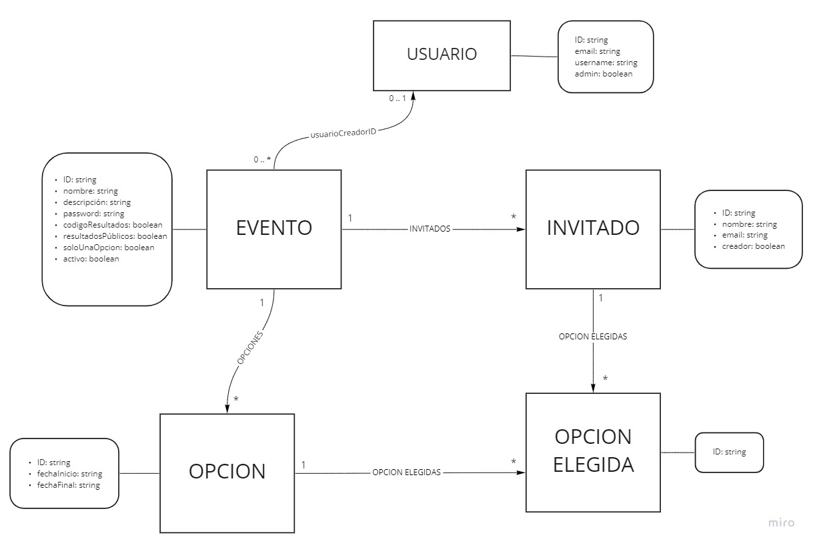

# Meeting-o-Matic

## ¿Cómo lo levanto?

El sistema está dividido en dos repos: uno para el backend y otro para el frontend.

* En ambos correr `npm install` para instalar las dependencias.
* En el **backend**, correr `npm start` para levantar la API en *localhost:3000*.
* En el **frontend**, correr `ng serve -o` para levantar el sistema en *localhost:4200*.

Aclaración: para la comunicación del front con el back, se utilizó **openapi-generator-cli**, una CLI que analiza la especificación Open API que genera el backend y desarrolla en typescript todos los controllers para iteractuar con los endpoints. Debido a algunar fallas que tiene el SDK, el código generado (que se encuentra en el directorio *destino*) fue modificado con respecto al original. Así que si uno corre el comando `npm run open-api`, puede que algunas funcionalidades no anden como deberían. Por lo tanto, se sugiere no correr el comando y dejar el directorio *destino* como está.

## Funcionalidades

### Públicas
Estas funcionalidades pueden ser realizadas por un usuario "guest", es decir, no es necesario estar ni logueado ni registrado.

* Crear un evento y agregar invitados
* Definir la configuración del evento: única opción, invitados dinámicos y resultados públicos/privados.
* Obtener (por única vez) el link para el evento y, opcionalmente, el link para los resultados. Aclaración: si en el momento de la confirmación del evento, el usuario que lo creó no guardó el link del mismo, no podrá volver a ver el evento.
* Ingresar, a través de un link, a un evento específico. Deberá ingresar la contraseña para ver los detalles y poder guardar sus elecciones.

### Privadas
Estas funcionalidades las puede realizar un usuario logueado.

* Crear un evento y agregar invitados
* Definir la configuración del evento: única opción, invitados dinámicos y resultados públicos/privados.
* Obtener, las veces que haga falta, el link del mismo para enviárselo a los invitados
* Ver los eventos creados y sus resultados.
* Modificar el evento.
* Agregar nuevos invitados una vez que ya fue creado el evento.
* Desactivar un evento. Esto hace que los invitados no puedan guardar sus elecciones.
* Clonar eventos. Replica un evento particular con su configuración, invitados, opciones, nombre y descripción en un solo click.

### Administración

* Ver todos los usuarios
* Ver todos los eventos creados.
* Eliminar usuarios y eventos.

## Base de Datos e información

El backend está configurado para usar un cluster en mongocloud. En él se encuentran las colecciones ya armadas y con datos de ejemplo. Existe el usuario 'admin@admin.com' con contraseña 'admin', el único que puede ver los listados totales de eventos y usuarios.

Además, como ejemplo se puede loguear con 'fer@gmail.com' con contraseña '123123'.

### Esquema 

